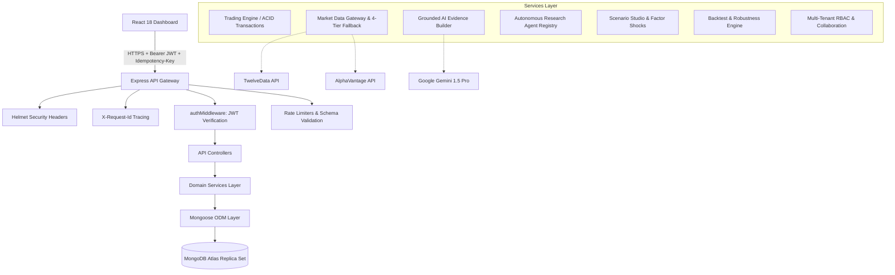
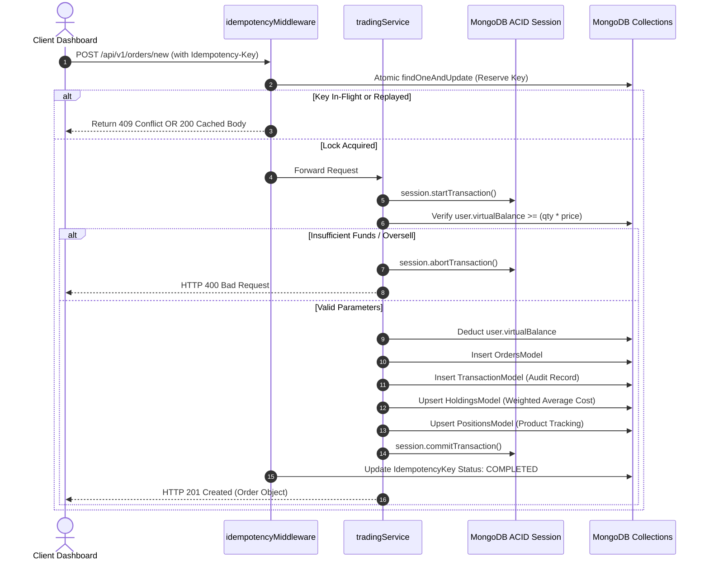
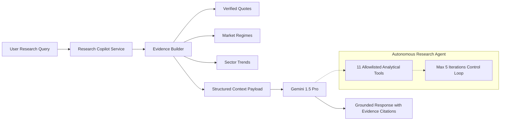

# TRADEFLOW — COMPLETE SYSTEM ARCHITECTURE REFERENCE
**Release Version**: 2.0-PRODUCTION  
**Architectural Paradigm**: Clean Layered SaaS Architecture (MERN Stack + Grounded AI + Provider Abstraction)  
**Security Standard**: OWASP ASVS 5.0.0 Aligned Controls  

---

## 1. System Architecture Overview

TradeFlow is architected as an enterprise-grade paper trading, market intelligence, and quantitative research platform. It enforces a strict unidirectional layered flow from client presentation down to persistent storage:



---

## 2. Frontend Architecture (`dashboard/`)

- **Component Hierarchy**: Modular React 18 single-page application built with functional components and hooks.
  - `components/`: Specialized UI widgets (`Holdings`, `Orders`, `WatchList`, `TradeJournal`, `MarketScanner`, `StressStudio`, `StrategyLab`, `ResearchCopilot`, `InterviewDemo`).
  - `context/`: Shared global state (`GeneralContext.js`) handling active symbol selections and toast alerts.
  - `services/`: Axios HTTP client configured with bearer token interceptors and automatic `X-Request-Id` propagation.
- **Styling Architecture**: Vanilla CSS with tailored HSL tokens, dark mode palette, and CSS Grid/Flexbox layouts. Zero heavy utility-class dependencies.
- **Responsive Layout**: Fluid breakpoints covering desktop (1440px+), laptop (1024px), tablet (768px), and mobile (375px) with adaptive sidebars and responsive chart canvases.

---

## 3. Backend Architecture (`backend/`)

The backend strictly separates transport concerns from core financial and quantitative logic:

```text
Request ──> routes/ ──> middleware/ ──> controllers/ ──> services/ ──> models/ ──> MongoDB
```

1. **`routes/`**: Clean route declarations mounting middleware (`authMiddleware`, `idempotencyMiddleware`, validators).
2. **`middleware/`**: Cross-cutting concerns:
   - `authMiddleware.js`: Validates JWT, extracts `req.user = { userId, role }`.
   - `adminMiddleware.js`: Restricts access to administrative roles.
   - `idempotencyMiddleware.js`: Intercepts duplicate mutations via SHA-256 request hashing and atomic MongoDB locking.
   - `errorHandler.js`: Formats errors into standardized production envelopes with `requestId`.
3. **`controllers/`**: HTTP request unpacking, parameter validation, and response envelope formatting.
4. **`services/`**: Encapsulated business domain rules (ACID order matching, factor stress algorithms, Monte Carlo reshuffling).
5. **`models/`**: 28 strictly typed Mongoose schemas with compound indexes and validation rules.

---

## 4. Financial Trading Engine & Ledger Architecture

The paper trading engine is built to banking-grade transactional specifications:



---

## 5. Market Data Provider Abstraction

Market data routing utilizes a resilient 4-tier gateway designed to handle real-world API limits and network failures:

1. **Tier 1 (Primary)**: Live TwelveData REST integration with request timeout and response schema validation.
2. **Tier 2 (Secondary Fallback)**: AlphaVantage REST integration triggered if the primary throws network errors or rate limits.
3. **Tier 3 (In-Memory Cache)**: 5-minute TTL cache. Serves cached quotes tagged with `isStale: true`, `cachedAt`, and `cacheAgeSeconds`.
4. **Tier 4 (Terminal State)**: Explicit `DATA_UNAVAILABLE` error payload. The system **never fabricates fictitious quotes**.

---

## 6. Grounded AI & Autonomous Research Architecture



- **Tool Whitelist**: `fetch_quote`, `fetch_technicals`, `run_scenario`, `fetch_regime`, `scan_universe`, etc.
- **Safety Boundary**: Zero direct database access, zero shell execution, zero automated balance or order mutations.

---

## 7. Multi-Tenant Organizations & RBAC

- **Tenant Isolation**: Every database collection enforces user or organization scoping. Portfolios are strictly private to individual user accounts.
- **Role Hierarchy**:
  - `OWNER`: Full organization administration, billing, and membership controls.
  - `ADMIN`: Team management and shared research administration.
  - `RESEARCHER`: Conduct shared research sessions and post threaded counter-evidence comments.
  - `VIEWER`: Read-only access to organization research canvases.

---

## 8. Observability & Telemetry

- **Correlation Tracing**: Every inbound HTTP request is assigned a unique `X-Request-Id` UUID, propagated through service layers, and returned in the HTTP response headers.
- **Structured Logging**: Morgan development logging coupled with `SystemEventModel` audit trails.
- **Sanitized Telemetry**: Sensitive authorization tokens, passwords, and MongoDB connection strings are scrubbed before writing to logs.
- **Health Diagnostics**:
  - `GET /api/health`: Uptime probe.
  - `GET /api/health/detailed`: Deep diagnostic probe checking MongoDB replica set connectivity, market provider status, and AI engine status.
