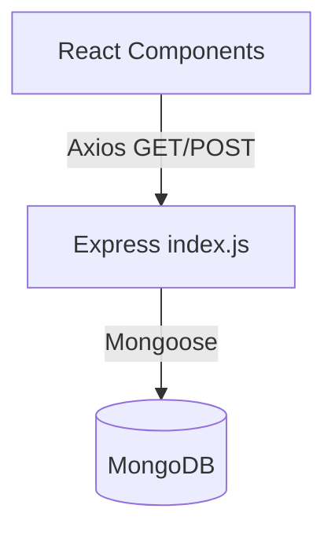
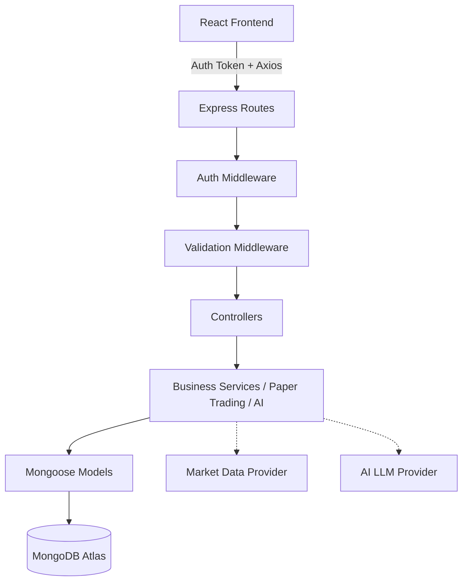

# Architecture Documentation

## 1. Current Architecture (As-Is)

### Frontend
- **Framework**: React (Create React App), React Router DOM.
- **State Management**: React Context (`GeneralContext.js`), local component state.
- **Styling**: Vanilla CSS, MUI Icons.
- **Data Fetching**: Axios directly inside components.
- **Structure**: Flat `components/` directory. Static mock data in `data/data.js`.

### Backend
- **Framework**: Node.js + Express.
- **Structure**: Flat. Everything is in `index.js`, except models.
- **Database**: MongoDB (Mongoose).
- **Data Flow**: `Route -> Mongoose Model -> DB`. Missing controllers and services.
- **Security**: Basic CORS. No auth, no validation.

## 2. Target Architecture (To-Be)

### Frontend
- **Structure**: Modularized into `pages/`, `components/`, `services/` (API clients), `hooks/`, `context/`.
- **Styling**: Improved CSS architecture (modules or styled-components).
- **State**: Enhanced Context API or Redux if needed.

### Backend
- **Structure**: MVC-like layered architecture.
    - `routes/` (Endpoint definitions)
    - `controllers/` (Req/Res handling)
    - `services/` (Business logic, Paper Trading Engine)
    - `models/` (Mongoose schemas)
    - `middleware/` (Auth, Error handling, Validation)
- **Market Data**: Abstracted service layer.

## 3. Data Flow Example: Placing an Order
1. User submits Buy order on frontend.
2. Axios `POST /api/v1/orders` with JWT token.
3. `authMiddleware` verifies JWT and attaches `req.user`.
4. `orderValidator` validates input (symbol, qty, price).
5. `OrderController.createOrder` receives request.
6. `TradingService.executeOrder` checks user's `virtualBalance`.
7. Deducts balance, creates `Transaction`, updates `Holdings`/`Positions`, saves `Order`.
8. Controller returns success response.
9. Frontend updates UI state and shows Toast notification.
