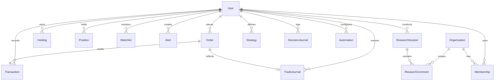

# TRADEFLOW — DATABASE SCHEMA & DATA MODEL REFERENCE
**Database Engine**: MongoDB Atlas (MongoDB 6.0+ Replica Set)  
**ORM / Driver**: Mongoose v8.24.4  
**Data Integrity Status**: Verified 0 orphaned or corrupt records via `backend/final_data_integrity_check.js`  

---

## 1. Entity Relationship Overview

---

## 2. Core Financial Models (ACID Double-Entry Ledger)

### 2.1 `User` (`users` collection)
- **Purpose**: Primary identity, authentication credentials, and virtual cash balance.
- **Fields**:
  - `_id`: ObjectId (Primary Key)
  - `name`: String (Required)
  - `email`: String (Required, Unique, Lowercase, Indexed)
  - `password`: String (Bcrypt Hash, Required)
  - `virtualBalance`: Number (Default: 100,000, Non-negative)
  - `role`: String (Enum: `['USER', 'ADMIN']`, Default: `'USER'`)
  - `createdAt`: Date
  - `updatedAt`: Date

### 2.2 `Order` (`orders` collection)
- **Purpose**: Immutable historical record of paper trade execution.
- **Fields**:
  - `_id`: ObjectId
  - `user`: ObjectId (Ref: `User`, Required, Indexed)
  - `name`: String (Asset Symbol, Required, e.g. `'RELIANCE'`)
  - `qty`: Number (Positive Integer, Required)
  - `price`: Number (Execution Price, Positive, Required)
  - `mode`: String (Enum: `['BUY', 'SELL']`, Required)
  - `createdAt`: Date
- **Indexes**: `{ user: 1, createdAt: -1 }`

### 2.3 `Holding` (`holdings` collection)
- **Purpose**: Long-term asset portfolio holding with weighted average cost accounting.
- **Fields**:
  - `_id`: ObjectId
  - `user`: ObjectId (Ref: `User`, Required, Indexed)
  - `name`: String (Asset Symbol, Required)
  - `qty`: Number (Positive Number, Shares Held)
  - `avg`: Number (Weighted Average Purchase Price)
  - `price`: Number (Current Market Price)
  - `net`: String (P&L percentage representation)
  - `day`: String (Intraday change representation)
  - `isLoss`: Boolean
- **Indexes**: `{ user: 1, name: 1 }` (Unique compound index)

### 2.4 `Position` (`positions` collection)
- **Purpose**: Open trade positions (CNC delivery or MIS intraday).
- **Fields**:
  - `_id`: ObjectId
  - `user`: ObjectId (Ref: `User`, Required)
  - `product`: String (Default: `'CNC'`)
  - `name`: String (Asset Symbol)
  - `qty`: Number (Positive Number)
  - `avg`: Number (Average Price)
  - `price`: Number (Last Traded Price)

### 2.5 `Transaction` (`transactions` collection)
- **Purpose**: Audit-grade double-entry cash flow ledger.
- **Fields**:
  - `_id`: ObjectId
  - `user`: ObjectId (Ref: `User`, Required, Indexed)
  - `type`: String (Enum: `['BUY', 'SELL']`, Required)
  - `symbol`: String (Asset Symbol)
  - `quantity`: Number (Shares Transacted)
  - `price`: Number (Transaction Unit Price)
  - `amount`: Number (Total Cash Value Debited or Credited)
  - `balanceBefore`: Number (Cash Balance Prior to Transaction)
  - `balanceAfter`: Number (Cash Balance Following Transaction)
  - `order`: ObjectId (Ref: `Order`)
- **Indexes**: `{ user: 1, createdAt: -1 }`

### 2.6 `IdempotencyKey` (`idempotencykeys` collection)
- **Purpose**: Concurrency locking and duplicate replay suppression for orders.
- **Fields**:
  - `_id`: ObjectId
  - `key`: String (Client UUID from header, Required)
  - `user`: ObjectId (Ref: `User`, Required)
  - `endpoint`: String (Target Route)
  - `requestHash`: String (SHA-256 hash of payload)
  - `status`: String (Enum: `['IN_PROGRESS', 'COMPLETED', 'FAILED']`)
  - `responseStatus`: Number (e.g. 201)
  - `responseBody`: Mixed (Cached JSON payload)
  - `createdAt`: Date (TTL expiration after 86,400 seconds / 24 hours)
- **Indexes**: `{ user: 1, key: 1 }` (Unique), `{ createdAt: 1 }` (ExpireAfterSeconds: 86400)

---

## 3. Market, Watchlist & Alerts Models

### 3.1 `Watchlist` (`watchlists` collection)
- **Fields**: `user` (Ref: `User`), `symbol` (Uppercase String).
- **Index**: `{ user: 1, symbol: 1 }` (Unique).

### 3.2 `Alert` (`alerts` collection)
- **Fields**: `user` (Ref: `User`), `symbol` (String), `condition` (Enum: `['ABOVE', 'BELOW']`), `targetPrice` (Number), `isActive` (Boolean, Default: true), `triggeredAt` (Date).
- **Index**: `{ user: 1, symbol: 1, condition: 1, targetPrice: 1, isActive: 1 }`.

### 3.3 `MarketEvent` (`marketevents` collection)
- **Fields**: `title`, `summary`, `category` (MACRO, EARNINGS, GEOPOLITICAL), `severity`, `affectedSymbols`, `transmissionHash` (Unique deduplication hash).

---

## 4. Research, Strategy & Analytics Models

### 4.1 `ResearchSession` (`researchsessions` collection)
- **Fields**: `user` (Ref: `User`), `title`, `symbol`, `scope`, `evidence` (Array of cited sources), `synthesis`, `sharedWithOrg` (Boolean), `organization` (Ref: `Organization`).

### 4.2 `Strategy` (`strategies` collection)
- **Fields**: `user` (Ref: `User`), `name`, `version` (Number), `universe` (Array of Symbols), `benchmark`, `initialCapital`, `entryRules`, `exitRules`, `isArchived` (Boolean).

### 4.3 `DecisionJournal` (`decisionjournals` collection)
- **Fields**: `user` (Ref: `User`), `title`, `symbol`, `decisionType` (Enum: `['OPEN_RESEARCH', 'PAPER_BUY', 'PAPER_SELL', 'HOLD', 'WATCH', 'ABANDON']`), `thesis`, `timeline` (Array of events).

### 4.4 `TradeJournal` (`tradejournals` collection)
- **Fields**: `user` (Ref: `User`), `order` (Ref: `Order`, Unique), `symbol`, `side`, `strategy`, `reason`, `confidence` (1-5), `thesis`, `entryPrice`, `quantity`, `marketSnapshot`.

### 4.5 `Automation` (`automations` collection)
- **Fields**: `user` (Ref: `User`), `name`, `type` (Enum: `['DAILY_BRIEF', 'PORTFOLIO_REVIEW', 'RESEARCH_REVIEW', 'STRATEGY_REVIEW', 'JOURNAL_REVIEW', 'EVENT_DIGEST']`), `schedule` (Enum), `enabled` (Boolean).

---

## 5. Multi-Tenant Organizations & RBAC Models

### 5.1 `Organization` (`organizations` collection)
- **Fields**: `name` (String, Required), `owner` (Ref: `User`, Required), `planTier` (Enum: `['COMMUNITY', 'TEAM_PRO', 'ENTERPRISE']`).

### 5.2 `Membership` (`memberships` collection)
- **Fields**: `organization` (Ref: `Organization`, Required), `user` (Ref: `User`, Required), `role` (Enum: `['OWNER', 'ADMIN', 'RESEARCHER', 'VIEWER']`), `status` (Enum: `['ACTIVE', 'INVITED', 'SUSPENDED']`).
- **Index**: `{ organization: 1, user: 1 }` (Unique).

### 5.3 `ResearchComment` (`researchcomments` collection)
- **Fields**: `researchSession` (Ref: `ResearchSession`), `organization` (Ref: `Organization`), `author` (Ref: `User`), `body` (String), `evidenceType` (Enum: `['SUPPORTS_THESIS', 'CONTRADICTS_THESIS', 'NEUTRAL']`), `resolved` (Boolean).
